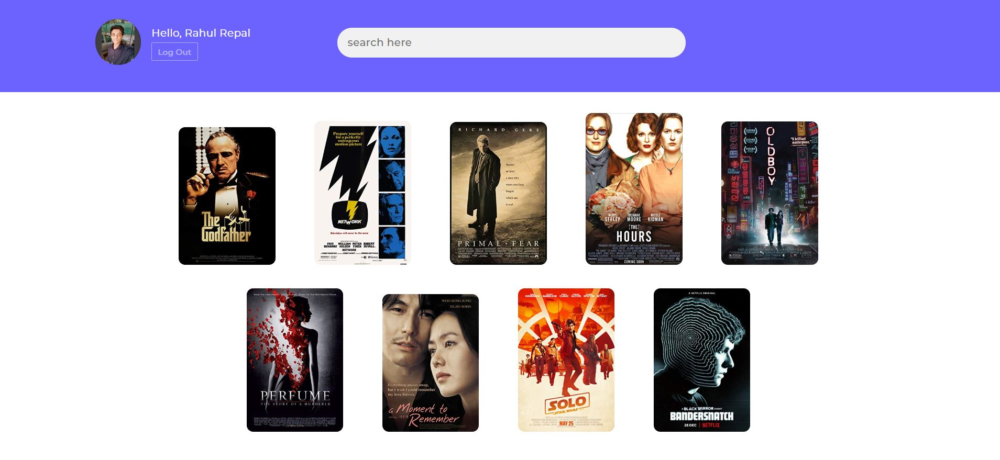

# react-movie-bookmark
React movie bookmark is a simple, responsive react app that uses Firebase for backend and utilizes the omdb api which is a free  RESTful web service to obtain movie information.

## Demo
[react-movie-bookmark - Live DEMO](https://bomonew-e241c.firebaseapp.com/)

### Tools
| Name             | Description   |
| :-------------:|--------------|
| react |  JavaScript library for building user interfaces. |
| react-router-dom | DOM bindings for [React Router](https://reacttraining.com/react-router/) |
| firebase| Firebase JavaScript library for web and Node.js |
| simple-react-validator | A simple react and react native form validator inspired by Laravel validation. |
| react-s-alert | React component which provides alerts or notifications with rich configuration possibilities. | 
| react-content-loader | SVG-Powered component to easily create placeholder loadings (like Facebook's cards loading). |  

### Requirements
- [Node](https://nodejs.org/)
- [npm](https://npmjs.com) 
- [firebase](https://www.npmjs.com/package/firebase)

## Installation
[node.js](http://nodejs.org/download/) is required to get ``npm``.

If you would like to download the code and try it for yourself:

1. Clone the repo: `git@github.com:SKempin/react-movie-bookmark.git`
2. `cd react-movie-bookmark`
2. Install packages: `npm install` and `bower install`
3. Replace Firebase config object and omdb api key
4. Run Project: `npm start`
5. Open your browser at: `http://localhost:3000`

Get api key -
[OMDB](http://www.omdbapi.com/) 

## License
You are welcome to use this however you wish within the MIT license, but please retain my credentialsand links back to [this repo](https://github.com/rahulrepal/movies-react-app).